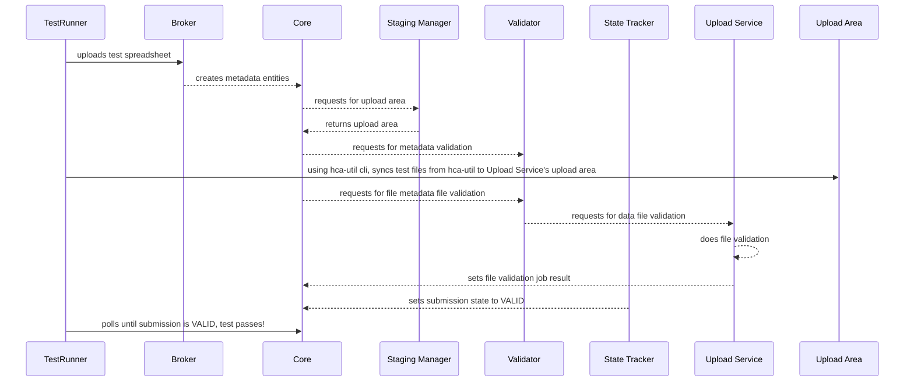

[](https://gitlab.ebi.ac.uk/hca/ingest-integration-tests/-/commits/dev)


# Ingest Integration Tests
Integration tests for ingest components.



## Developer Notes

### Running Locally

#### Local Shell Environment

##### Setting Up the Environment
1. Go to local directory where repository is cloned.

```
cd ingest-integration-tests
```

2. The tests require a Python 3 environment to run. Set up a python virtual environment.

3. Install dependencies.

```
pip install -r requirements.txt
```
4. For the tests to be able to successfully authenticate with Ingest Core API, the GCP credentials need to be 
made locally available.

    * Create `_local` directory. The `_local` directory is being ignored by git for this repo. This is to avoid accidentally committing this secret to GitHub.
    If you're not downloading to `_local`, make sure you have Git Secrets set up. See the documentation for setting up and configuring Git Secrets.
    ```
    mkdir _local
    ```
    * The GCP credentials are stored in AWS Secrets Manager; To download GCP credentials and save it into a file, the AWS CLI can be used:
    
    ```
     aws secretsmanager get-secret-value \
     --region us-east-1 \
     --secret-id ingest/dev/gcp-credentials.json | jq -r .SecretString > _local/gcp-credentials-dev.json
    ```

##### Running a Single Test

To run a single test, make sure that all necessary environment variables are provided.

```
export AWS_PROFILE=embl-ebi; \
export DEPLOYMENT_ENV=dev; \
export INGEST_API_JWT_AUDIENCE=https://dev.data.humancellatlas.org/; \
export DEPLOYMENT_STAGE=${DEPLOYMENT_ENV}; \
export ARCHIVER_API_KEY=$(aws secretsmanager get-secret-value --region us-east-1 --secret-id ingest/${DEPLOYMENT_ENV}/secrets --query SecretString --output text | jq -jr '.archiver_api_key'); \
export HCA_UTIL_ADMIN_ACCESS=$(aws secretsmanager get-secret-value --region us-east-1 --secret-id hca/util/aws-access-keys --query SecretString --output text | jq -jr '.ADMIN_ACCESS_KEY'); \
export HCA_UTIL_ADMIN_SECRET=$(aws secretsmanager get-secret-value --region us-east-1 --secret-id hca/util/aws-access-keys --query SecretString --output text | jq -jr '.ADMIN_SECRET_ACCESS_KEY'); \
export HCA_UTIL_ADMIN_PROFILE='test-hca-util-admin'; \
export GOOGLE_APPLICATION_CREDENTIALS=_local/gcp-credentials-dev.json; \
python3 -m unittest tests.test_ingest.TestRun.test_ingest_to_upload
``` 

#### Gitlab Runner

The integration tests are primarily designed to run through the Gitlab CI/CD pipeline mechanism. The tests can be run
through Gitlab locally using `gitlab-runner` that can either be installed or be run as Docker container. Please refer
to [the officially documentation](https://docs.gitlab.com/runner/) for more information.