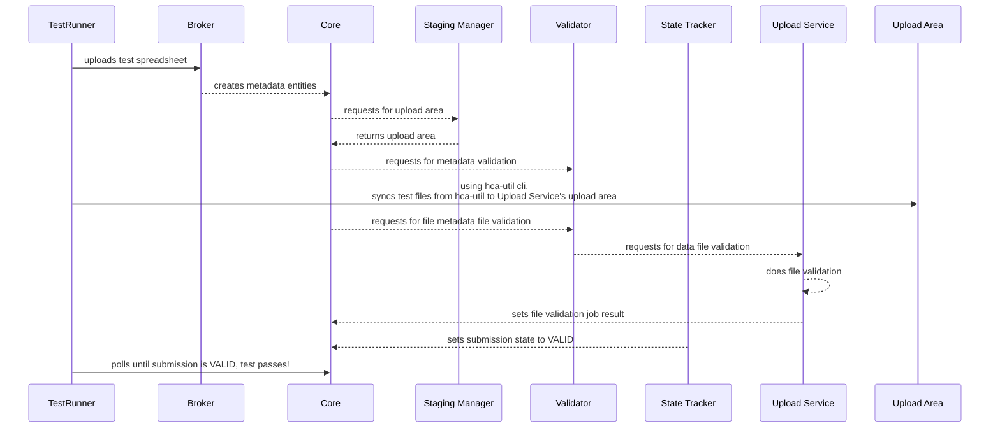
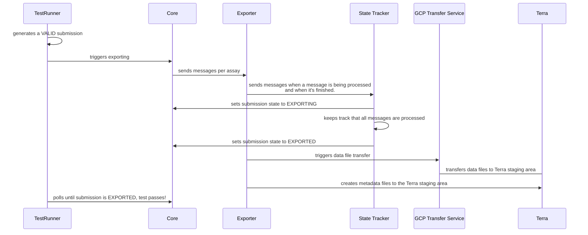
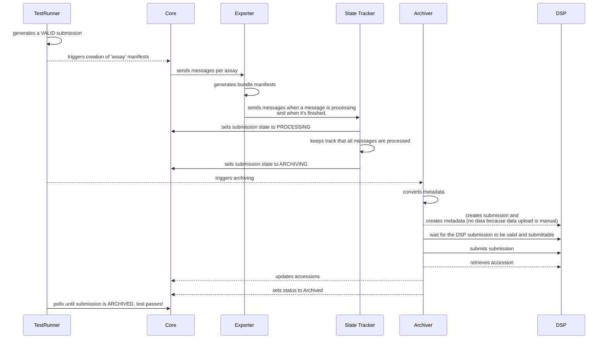
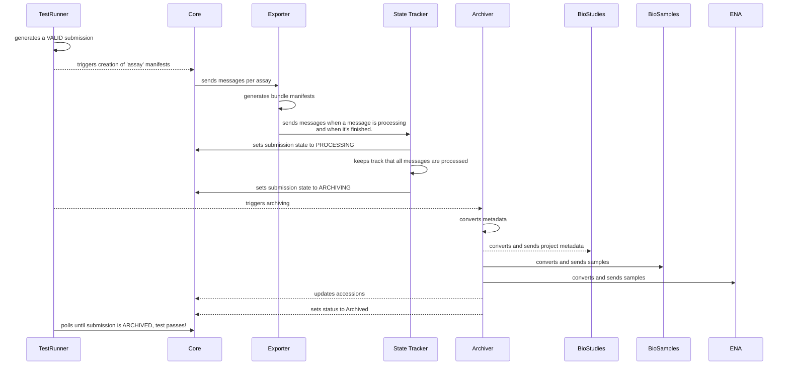
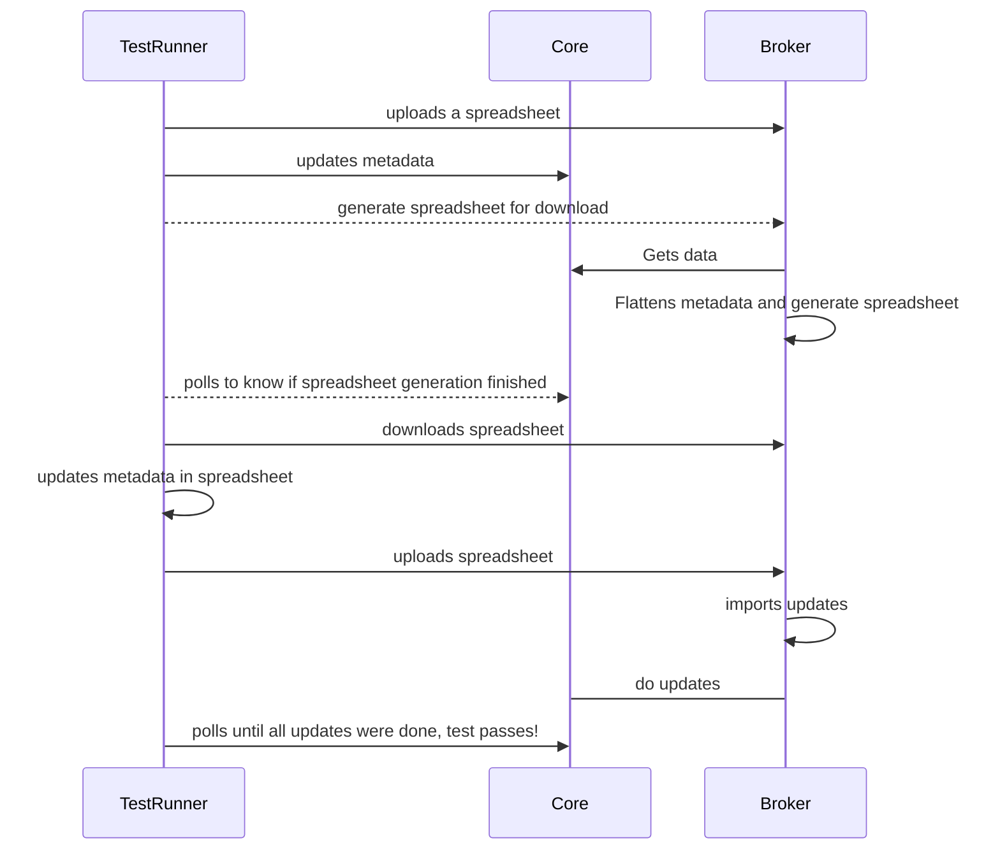

# Integration Tests

+ [ingest_to_upload](#ingest_to_upload)
+ [ingest_to_terra](#ingest_to_terra)
+ [ingest_to_archives](#ingest_to_archives)
+ [ingest_to_direct_archives](#ingest_to_direct_archives)
+ [bulk_update](#bulk_update)

### ingest_to_upload

Tests the flow from spreadsheet upload, data file upload and data file validation and verifies that the submission state will transition to `VALID` when metadata an data files are validated.

### ingest_to_terra
Tests the submission flow from Ingest to Terra. The test will generate a valid submission, verifies that the submission will be exported by checking that transition to `Exported` state.

### ingest_to_archives
Tests the submission flow from Ingest to the EBI public archives. The test will generate a valid submission, verifies that the submission will be archived by checking that transition to `Archived` state.

### ingest_to_direct_archives
Tests the submission flow from Ingest to the EBI public archives using the new implementation for the Archiver which is not using Data Submission Portal API.

### bulk_update
Tests the bulk updates flow. 

